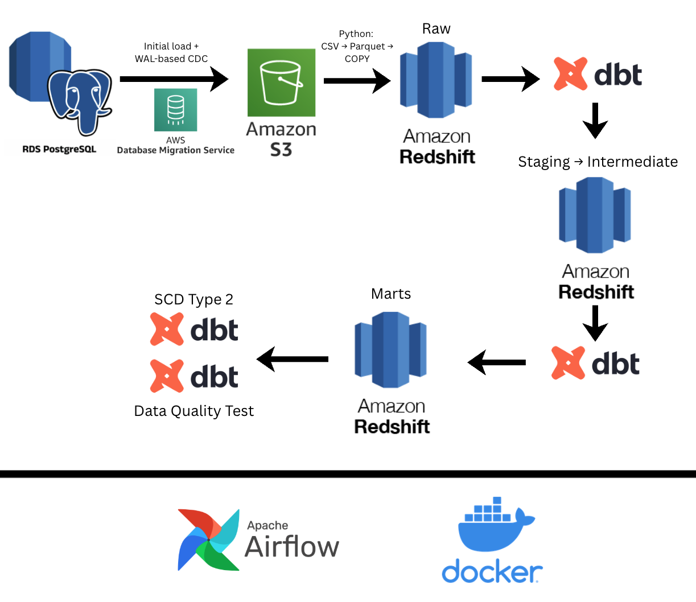
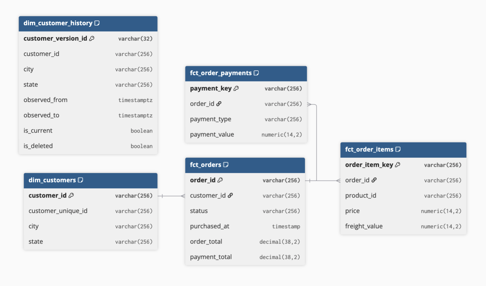

# E-commerce CDC Pipeline

This AWS pipeline captures changes in PostgreSQL and builds e-commerce analytics
marts in Redshift. It uses the [Olist dataset](docs/source.md) to demonstrate
change data capture (CDC), orchestration, dimensional modeling, and recovery
from failures.

The source has **415,418 historical rows** in four tables: customers, orders,
order items, and payments. Python simulates new business transactions.
PostgreSQL generates real write-ahead logs (WAL), which AWS DMS reads to capture
the changes.

## Technical highlights

- **Log-based CDC:** AWS DMS loads the initial data from RDS PostgreSQL, then
  captures inserts, updates, and deletes.
- **Python and warehouse ingestion:** Python keeps the original CSV files in S3,
  converts them to Parquet with explicit data types, and loads Redshift with `COPY`.
- **Reliable processing:** apply changes in source order, deduplicate replayed
  events, and handle hard deletes. Raw rows and the record of their loaded file
  commit in one transaction, so a failed load can be retried safely.
- **SQL and dimensional modeling:** dbt builds staging and intermediate views,
  then five marts. Customer SCD Type 2 history keeps earlier customer versions.
  Items and payments are aggregated separately to avoid double-counting totals.
- **Orchestration:** Airflow runs locally in Docker every five minutes. It skips
  warehouse work when no files have changed and marks a batch complete only after
  builds and tests pass. Raw loading is incremental; each batch with new data
  fully rebuilds the marts.
- **Data quality:** source-to-target reconciliation checks that warehouse data
  matches the source. dbt tests check the models. GitHub CI uses temporary
  PostgreSQL test databases and checks Airflow task states.

## Vendor architecture

All Redshift icons refer to layers in the same Redshift Serverless warehouse.
dbt builds customer history and tests the models. Airflow starts downstream
microbatches every five minutes.

## Simplified marts schema

| Mart | Grain — one row per |
|---|---|
| `dim_customers` | Current customer record |
| `dim_customer_history` | Observed customer version or deletion marker |
| `fct_orders` | Current order, with item and payment totals |
| `fct_order_items` | Current order item |
| `fct_order_payments` | Current payment entry |

Orders join to current customer details. A separate table keeps SCD Type 2
history. The diagram shows selected columns and logical relationships.
[Full model definitions](docs/warehouse.md).

## Validation

| Evidence | Result |
|---|---|
| Earlier AWS runs | Loaded the historical dataset and verified replay, deletes, recovery, and source-to-target reconciliation. |
| September 24 scheduled AWS run | Five Airflow runs in a row processed 90 simulated changes. All four current warehouse tables matched RDS after each run. |
| Current simplified code | 56 local tests passed. Parsing with the Redshift adapter confirmed 14 models and 39 dbt data tests. The current code still needs a new end-to-end Redshift test. |

The AWS results are from earlier code versions, before the latest model changes.
See the [test results](docs/validation.md),
[five-cycle report](docs/five-cycle-validation.md), and
[GitHub CI](https://github.com/KevDev7/e-commerce-cdc-pipeline/actions).

## Run the project

Follow the **[AWS runbook](docs/run-cloud.md)** to set up the pipeline, simulate
transactions, run scheduled batches, check results, and clean up. It also explains
the budget and when to create or remove AWS resources. To run tests without AWS,
use the [development guide](docs/development.md).

- [Source data and simulated workload](docs/source.md)
- [Warehouse design](docs/warehouse.md) and [dbt processing](docs/dbt-processing.md)
- [S3 file layout](docs/s3-layout.md)
- [Reliability checks](docs/reliability.md) and [verification scenarios](docs/verification.md)
- [Future learning roadmap](docs/roadmap.md)
